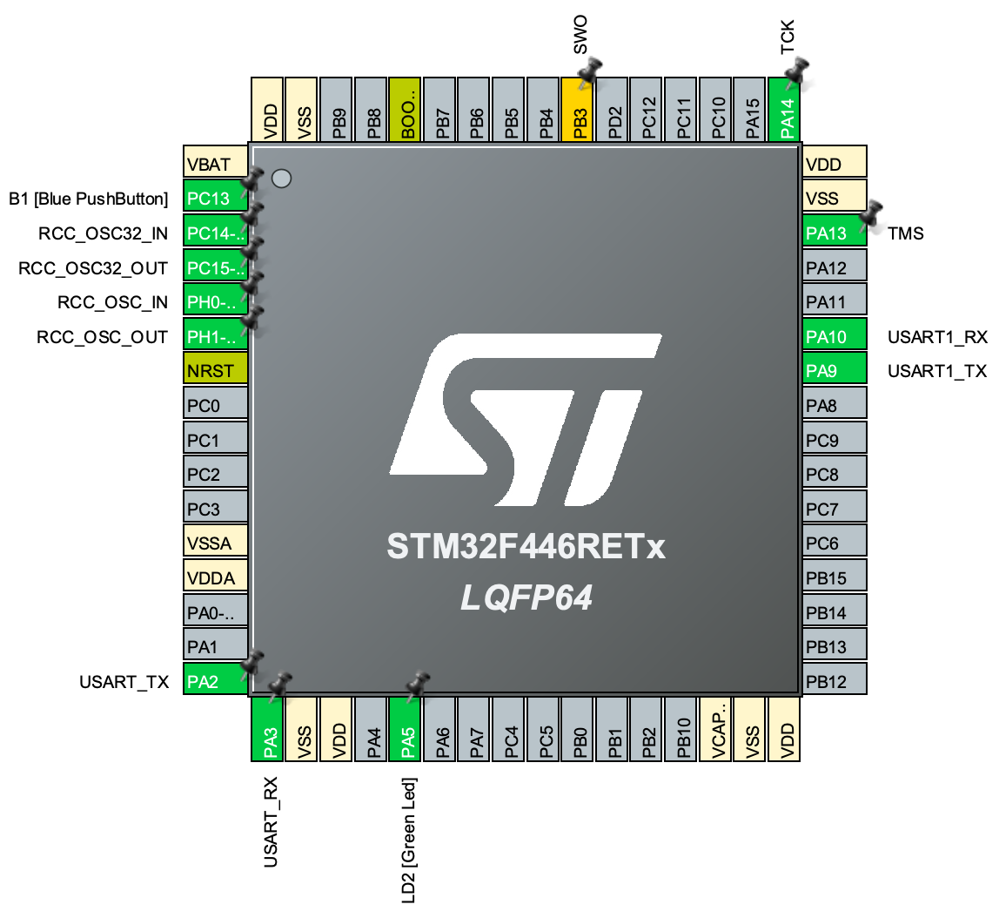

# GPS Module: NEO-M9N - Usage and Implementation Guide

This document provides an overview of the **NEO-M9N GPS module** and a guide for integrating it with STM32 microcontrollers. We will explore how the GPS module works, its integration, and how to receive accurate GPS coordinates in your embedded system.

---

## Table of Contents 
1. [Introduction](#introduction)
2. [How GPS Works](#how-gps-works)
3. [Hardware Integration](#hardware-integration)
4. [Software Integration](#software-integration)
5. [Data Processing and NMEA Sentences](#data-processing-and-nmea-sentences)
6. [Further Reading](#further-reading)

---

## Introduction
The **NEO-M9N** is a high-performance multi-GNSS module from **u-blox**, supporting concurrent reception of multiple GNSS systems, including **GPS**, **GLONASS**, **Galileo**, and **BeiDou**. It is designed for applications that require high precision, robust performance, and reliability, making it ideal for projects such as **rocketry**, **UAVs**, and **high-altitude** data logging.

This guide will walk you through how to set up the NEO-M9N with an **STM32F446RE** microcontroller, explaining both the hardware connections and software required to extract data from the module.

---

## How GPS Works

Global Positioning System (**GPS**) uses a constellation of satellites that continuously transmit signals to Earth. A **GPS receiver** (like the NEO-M9N) listens to these signals and calculates its position by triangulating signals from at least **four satellites**. The more satellites the GPS receiver can "see," the more accurate the position.

1. **Satellite Signals**: Satellites transmit data containing their position and the time the signal was sent.
2. **Position Calculation**: The GPS receiver calculates the time difference between when the signal was sent and when it was received. Using this, along with the satellite's known position, the receiver determines its own location.
3. **NMEA Sentences**: The GPS receiver then sends data in standard formats like **NMEA sentences** to a microcontroller for further processing.

---

## Hardware Integration

To interface the **NEO-M9N GPS module** with an STM32 microcontroller, follow these steps:

### 1. **Connections:**
   - **VCC**: Connect to a 3.3V or 5V power supply (depending on your GPS module’s requirements).
   - **GND**: Connect to ground.
   - **TX**: Connect to the **RX** pin of your STM32 (e.g., PA10 for **USART1_RX**).
   - **RX**: Connect to the **TX** pin of your STM32 (e.g., PA9 for **USART1_TX**).
Here’s a basic schematic of the connections between the **STM32** and the **NEO-M9N GPS module**.

```plaintext
STM32F446RE         NEO-M9N GPS Module
+-----------+       +-----------------+
|           |       |                 |
|    TX(PA9)|------>| RX              |
|   RX(PA10)|<------| TX              |
|    GND    |-------| GND             |
|    3.3V   |-------| VCC             |
+-----------+       +-----------------+
```



### 2. **Baud Rate Configuration:**
   - Set the baud rate for communication to **9600 bps**, as this is the default baud rate for GPS communication.


## Software Integration

### 1. **UART Configuration**:
In **STM32CubeMX**, configure the UART (e.g., USART1) for communication with the GPS module. Set the **Baud Rate** to **9600 bps** and enable **interrupts** for receiving data continuously from the GPS module.

### 2. **Code Overview**:
The provided code initializes the UART communication and processes the **NMEA sentences** received from the GPS module. It parses the **latitude** and **longitude** and returns these values for further use in the system.

```c
void GPS_GetCoordinates(char *latitude, char *longitude)
{
    if (gps_data_received)
    {
        gps_data_received = 0;  // Reset the flag
        char *ptr = strstr(gps_buffer, "$GPRMC");  // Search for the GPRMC sentence
        if (ptr)
        {
            sscanf(ptr, "$GPRMC,%*[^,],%*[^,],%[^,],%*[^,],%[^,]", latitude, longitude);
        }
    }
}
```

### 3. **Receiving GPS Data**:
The GPS module continuously sends data, which is processed in **real-time** by the STM32 via the UART **RX interrupt**. The data is parsed and returned as **latitude** and **longitude**.

---

## Data Processing and NMEA Sentences

The GPS module outputs **NMEA sentences** in a human-readable ASCII format. The key sentence for extracting location data is **$GPRMC**, which contains information about latitude, longitude, speed, and more.

### Example of GPRMC Sentence:
```plaintext
$GPRMC,123519,A,4807.038,N,01131.000,E,022.4,084.4,230394,003.1,W*6A
```

- **Time**: `123519` - 12:35:19 UTC
- **Latitude**: `4807.038,N` - 48°07.038' North
- **Longitude**: `01131.000,E` - 11°31.000' East

The STM32 microcontroller extracts this data and returns it for further processing.

---

## Further Reading

- [u-blox NEO-M9N Datasheet](https://content.u-blox.com/sites/default/files/NEO-M9N-00B_DataSheet_UBX-19014285.pdf)
- [Understanding NMEA Sentences](https://www.sparkfun.com/datasheets/GPS/NMEA%20Reference%20Manual-Rev2.1-Dec07.pdf)

---
